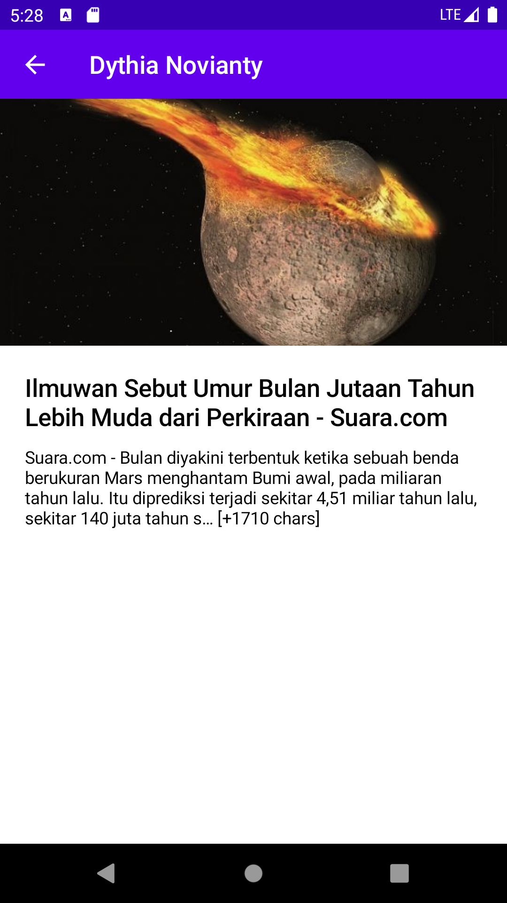

<!--
*** Thanks for checking out this README Template. If you have a suggestion that would
*** make this better, please fork the repo and create a pull request or simply open
*** an issue with the tag "enhancement".
*** Thanks again! Now go create something AMAZING! :D
-->

<!-- PROJECT SHIELDS -->
<!--
*** I'm using markdown "reference style" links for readability.
*** Reference links are enclosed in brackets [ ] instead of parentheses ( ).
*** See the bottom of this document for the declaration of the reference variables
*** for contributors-url, forks-url, etc. This is an optional, concise syntax you may use.
*** https://www.markdownguide.org/basic-syntax/#reference-style-links
-->

<!-- PROJECT LOGO -->
<br />
<p align="center">
  <a href="https://github.com/othneildrew/Best-README-Template">
  </a>

  <h1 align="center">Jetpack Compose Playground</h1>

  <p align="center">
    This is a project of me playing with <a href="https://developer.android.com/jetpack/compose">Jetpack Compose</a>.
  </p>
</p>

<p align="center">
     
</p>

<p align="center">
    the data used in this project comes from <a href="https://newsapi.org/">News Api</a>
</p>

<!-- TABLE OF CONTENTS -->
## Table of Contents

* [Built With](#built-with)
* [Contributing](#contributing)
* [License](#license)
* [Contact](#contact)
* [Acknowledgements](#acknowledgements)

## Built With
* [Kotlin](https://kotlinlang.org/)
* [Androidx](https://developer.android.com/jetpack/androidx)
* [Jetpack Compose](https://developer.android.com/jetpack/compose)
* [Coil](https://github.com/coil-kt/coil)
* [Accompanies](https://github.com/chrisbanes/accompanist)
* [Android Architecture Component](https://developer.android.com/topic/libraries/architecture/index.html)
* [Kotlin Coroutines](https://kotlinlang.org/docs/reference/coroutines-overview.html)
* [Retrofit](https://square.github.io/retrofit/)
* [Okhttp](https://square.github.io/okhttp/)
* [Gson](https://github.com/google/gson)
* [News Api](https://newsapi.org/)

<!-- CONTRIBUTING -->
## Contributing

1. Fork the Project
2. Create your Feature Branch (`git checkout -b feature/AmazingFeature`)
3. Commit your Changes (`git commit -m 'Add some AmazingFeature'`)
4. Push to the Branch (`git push origin feature/AmazingFeature`)
5. Open a Pull Request


<!-- LICENSE -->
## License

```
Copyright 2020 The Android Open Source Project
 
Licensed under the Apache License, Version 2.0 (the "License");
you may not use this file except in compliance with the License.
You may obtain a copy of the License at

    https://www.apache.org/licenses/LICENSE-2.0

Unless required by applicable law or agreed to in writing, software
distributed under the License is distributed on an "AS IS" BASIS,
WITHOUT WARRANTIES OR CONDITIONS OF ANY KIND, either express or implied.
See the License for the specific language governing permissions and
limitations under the License.

```

<!-- CONTACT -->
## Contact

Anang Kurniawan - [@anang_kur](https://twitter.com/anang_kur) - anang@sampingan.co.id

<!-- ACKNOWLEDGEMENTS -->
## Acknowledgements
### Repositories
* [Compose Sample by Android](https://github.com/android/compose-samples)
* [Compose Sample by Colin White](https://github.com/colinrtwhite/compose-samples)
* [Learn Jetpack Compose By Example](https://github.com/vinaygaba/Learn-Jetpack-Compose-By-Example)

### Articles
* [Jetpack Compose — A New and Simple Way to Create Material-UI in Android](https://medium.com/better-programming/jetpack-compose-a-new-and-simple-way-to-create-material-ui-in-android-f49c6fcb448b)
* [Exploring Images in Jetpack Compose](https://tech.instacart.com/exploring-images-in-jetpack-compose-c8ba87089c92)
* [JetPack Compose With Server Driven UI](https://medium.com/android-dev-hacks/jetpack-compose-with-server-driven-ui-396a19f0a661)

<!-- MARKDOWN LINKS & IMAGES -->
<!-- https://www.markdownguide.org/basic-syntax/#reference-style-links -->
[contributors-shield]: https://img.shields.io/github/contributors/othneildrew/Best-README-Template.svg?style=flat-square
[contributors-url]: https://github.com/othneildrew/Best-README-Template/graphs/contributors
[forks-shield]: https://img.shields.io/github/forks/othneildrew/Best-README-Template.svg?style=flat-square
[forks-url]: https://github.com/othneildrew/Best-README-Template/network/members
[stars-shield]: https://img.shields.io/github/stars/othneildrew/Best-README-Template.svg?style=flat-square
[stars-url]: https://github.com/othneildrew/Best-README-Template/stargazers
[issues-shield]: https://img.shields.io/github/issues/othneildrew/Best-README-Template.svg?style=flat-square
[issues-url]: https://github.com/othneildrew/Best-README-Template/issues
[license-shield]: https://img.shields.io/github/license/othneildrew/Best-README-Template.svg?style=flat-square
[license-url]: https://github.com/othneildrew/Best-README-Template/blob/master/LICENSE.txt
[linkedin-shield]: https://img.shields.io/badge/-LinkedIn-black.svg?style=flat-square&logo=linkedin&colorB=555
[linkedin-url]: https://linkedin.com/in/othneildrew

